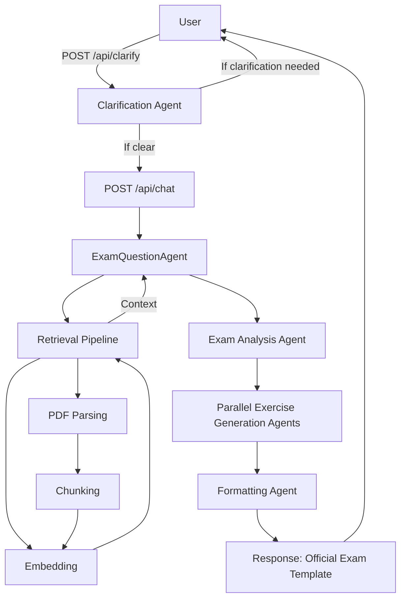

# EduMindAI-backend

EduMindAI-backend is an advanced Retrieval-Augmented Generation (RAG) backend designed to generate exams and questions that **faithfully match official exam topics, grade levels, difficulty, and structure**. Leveraging a multi-agent architecture, the system ensures that every generated exam mirrors the template, style, and rigor of real, official exams.

## Objective
- **Generate exams and questions that are indistinguishable from official exams**—right topics, right grade, right difficulty, right structure.
- When a user requests an exam, the system produces questions and compiles the exam using the **same template and structure as the official exams**.

## How It Works

### 1. Official Exam Ingestion & Indexing
- **Ingests a large collection of official exam PDFs and text files.**
- **Parsing:** Extracts text from each exam (using Azure Form Recognizer/OpenAI Vision for PDFs, or direct text loading).
- **Chunking:** Splits parsed text into overlapping, manageable chunks for fine-grained retrieval.
- **Embedding & Metadata Extraction:** Each chunk is embedded using OpenAI Embeddings and tagged with metadata (subject, branch, title, grade, topic) using an LLM.

### 2. Semantic Retrieval
- **User requests** (e.g., "Generate a grade 10 math exam on algebra and geometry") are parsed to extract subject, grade, and topics.
- The request is embedded and used to **retrieve the most relevant chunks** from the official exam database, filtered by metadata to ensure the right grade and topic.

### 3. Exam Generation & Structure Matching (Multi-Agent Orchestration)

- **Exam Analysis Agent:**
  - Analyzes the user’s request and the structure of official exams.
  - Splits the exam into several exercises, each with its own topic, grade, and question type, matching the official template.

- **Parallel Exercise Generation Agents:**
  - For each exercise, a dedicated agent generates a new question or exercise.
  - Each agent uses the retrieved official exam context to ensure the generated content matches the required topic, grade, difficulty, and detail.
  - All exercises are generated **in parallel** for efficiency.

- **Formatting Agent:**
  - After all exercises are generated, a formatting agent assembles them into a single, well-structured exam document.
  - The output matches the **official exam template** (sections, headings, formatting, etc.).

- **Clarification Agent:**
  - If the user’s request is missing key information (grade, topic, format), a clarification agent asks follow-up questions to ensure accuracy.

### 4. User Experience
- **Input:** User submits a request (e.g., "Generate a grade 10 math exam on algebra and geometry").
- **Clarification:** If needed, the system asks for missing details.
- **Output:** The system returns a complete exam, with each exercise matching the structure, style, and difficulty of official exams.

---

## Quickstart

### Prerequisites
- Python 3.9+
- [pip](https://pip.pypa.io/en/stable/)

### Installation
```bash
# Clone the repository
 git clone <repo-url>
 cd EduMindAI-backend

# Install dependencies
 pip install -r api/requirements.txt
```

### Configuration
Edit `api/config.yaml` to set your API keys and model parameters:
- `openai_api_key`: Your OpenAI API key
- `azure_formrecognizer_key` and `azure_formrecognizer_endpoint`: For Azure Form Recognizer (optional)
- `exams_path`: Path to the folder containing official exam documents

### Running the API
```bash
uvicorn api.main:app --reload
```
The API will be available at `http://127.0.0.1:8000/`.

### Main Endpoints
- `POST /api/clarify` — Checks if the user request is clear or needs more info
- `POST /api/chat` — Generates an exam or questions based on the user’s request

---

## Technical Architecture

### System Overview

EduMindAI-backend is built around a **multi-agent RAG architecture**:
- **ExamDataPipeline:** Ingests, parses, chunks, and embeds official exam documents.
- **VectorStore:** Stores and retrieves document chunks using semantic similarity and metadata.
- **ExamQuestionAgent:** Orchestrates retrieval, context assembly, and multi-agent exam generation.
- **API Endpoints:** Expose chat, search, and clarification functionality via FastAPI.

### Multi-Agent Exam Generation Flow



---

## Development
- Main app: `api/main.py`
- Chatbot logic: `api/chatbot.py`
- Exam data pipeline: `api/rag/exam_data_pipeline.py`
- Requirements: `api/requirements.txt`

### Linting & Formatting
You may use tools like `black` and `flake8` for code quality.

### Troubleshooting
If you encounter the following error: 
```
Your system has an unsupported version of sqlite3. Chroma requires sqlite3 >= 3.35.0
```
You can solve it by commenting the lines from 85 to 103 in the file `YOUR_PATH/chromadb/__init__.py`.

## License

This project is licensed under the MIT License.
